# Experiments settings and Use
This section elaborates the setup and also provides screenshots of how different solutions are used in our experiment. Here are the two segments showing the 'Setups' and 'Experiments':

##  Setups

### (S06) Sticky keys
It is a software feature in windows 10 that enables users to press key combinations in a sequence instead of pressing them simultaneously. It is useful when the user has partial ability to type on regular keyboards.The Sticky Keys is enabled and set accordingly:

### (S08) External Buttons
They are buttons that enables users to perform functions like mouse keys or key board combination keys. The function can be configured by user through JoyToKey program. They need to have XBox Adaptive Controller as the adapter as well. They are useful when users cannot perform these functions.The External Buttons are connected at port ‘A’ (Translating Left Click) and port ‘B’ (Translating Right Click):

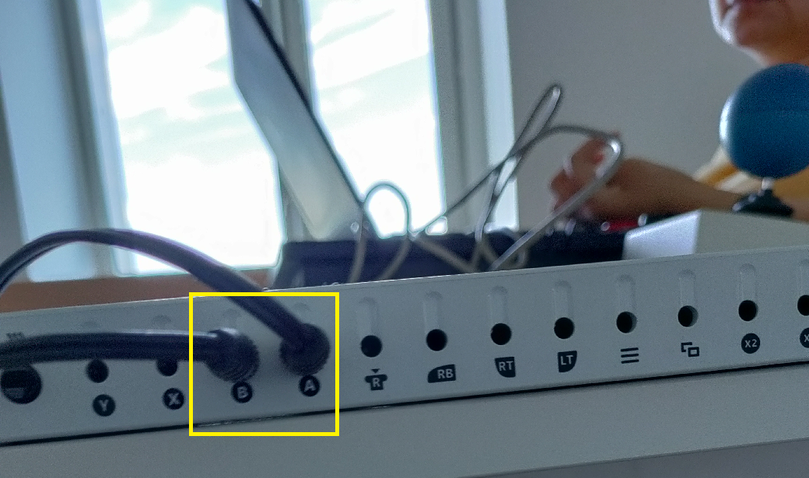

### (S10) Joy Stick
It is a pointing device like mouse but having bigger surface area that enables users to control the cursor movement easier. It is useful when the user has trouble with the mouse and the mouse pad due to the fast and erratic movement of the mouse.The Joystick is connected with the PC via USB cable as seen below:

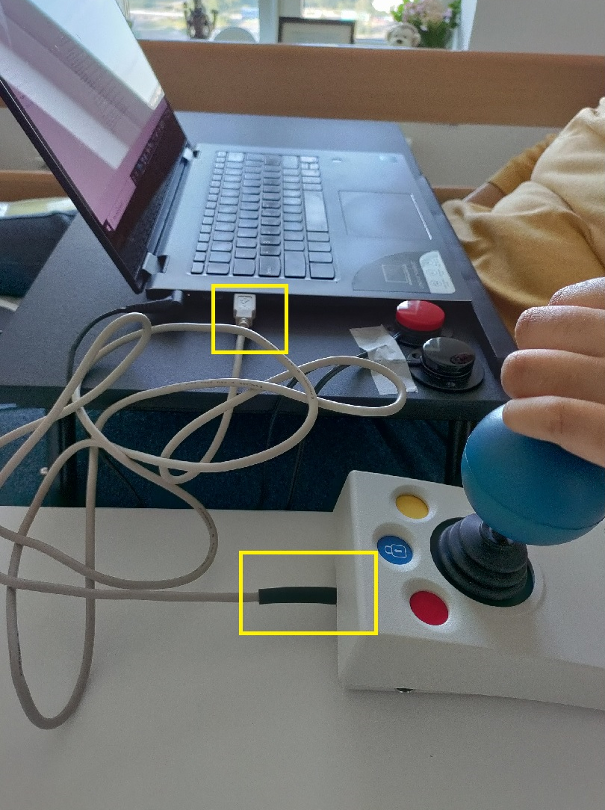

### (S11) JoyToKey program
It is a configuration device that enables definition of different functions like mouse click or combination keys press for different devices including External buttons and Joy Sticks.Here, you can find how JoyToKey is set to support the click and hold functions:

#### Click Settings

#### Hold Settings

### (S12) Xbox Adaptive Controller
 It is a game controller device with big buttons that enables functions like mouse click. It can also facilitate connecting JoyToKey to the External button, as an adapter. It is useful when the user has trouble to use click functions of mouse. The Xbox Adaptive Controller is added using the bluetooth:## (S12) XAC
The Xbox Adaptive Controller is added using the bluetooth:

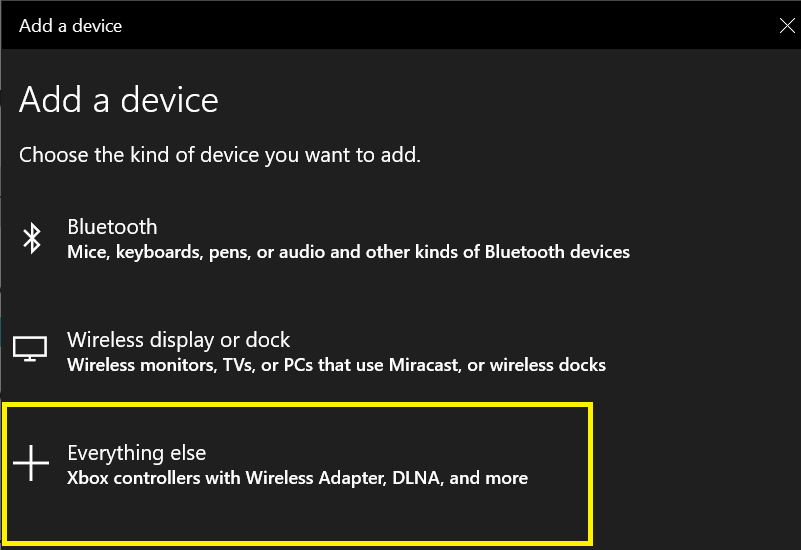

### (S15) Google chrome apps and extensions
These are add on features in Google Chrome browser and Firefox that provide extra features to users. It is useful for users who don’t have the dexterity required for moving and clicking the mouse. A simple hovering over an item can perform the click function. There are several extensions. We explain one of them here, i.e., Vimium. It is useful for users who cannot use the mouse for pointing but can use regular keyboard. Here is the ‘Vimium Extension’ that supports in various mouse related functions:

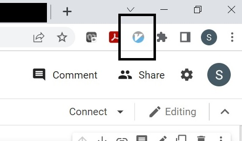

We can find the ‘Vimium Help’  (by clicking ‘?’) where we can see the keyboard shortcuts for various mouse related functions like scroll.

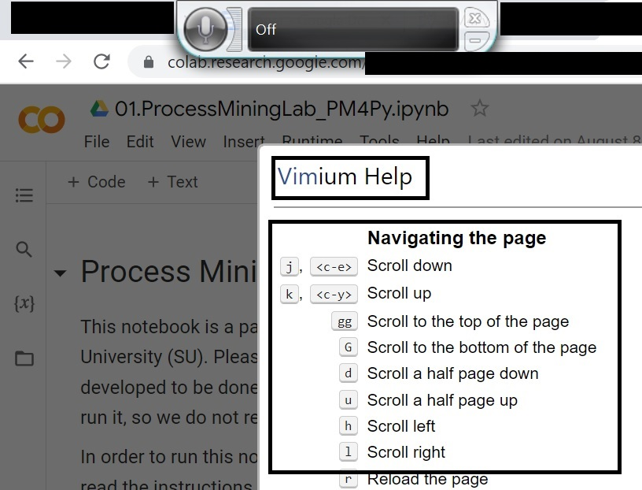

### (S20) Speech recognition input
 It is a software feature that performs functions like mouse click using voice control. An example is Mouse Grid in windows 10 that partition the screen into grids and users can click or perform other functions on these grids using voice. Here are the settings which need to be activated and set for proper functioning of the speech recognition inputs:

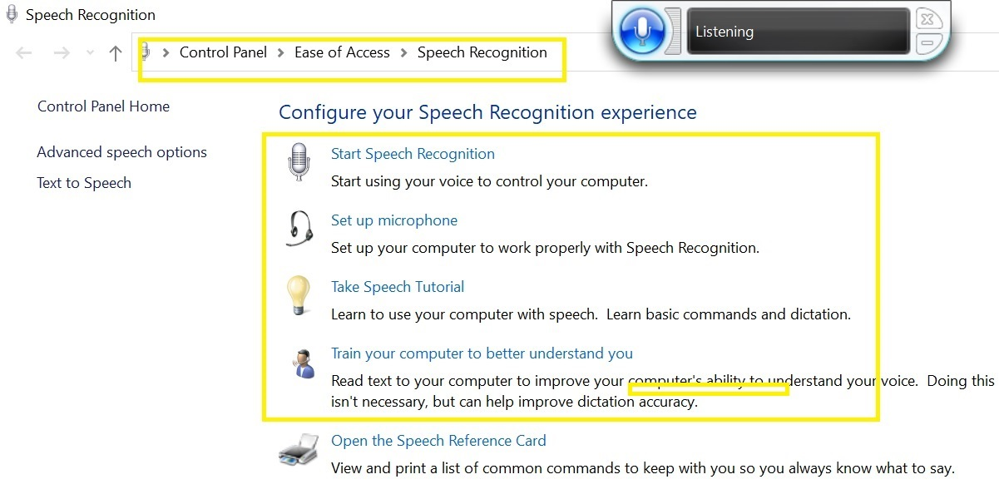

## Experiments

### (S06) Sticky keys
In this experiment, the sticky keys gave support in typing with the modifier keys (Shift keys, Control keys, Alt keys and windows keys). Here is the screenshot showing how sticky keys enabled typing code in Google Colab to support usage of PM4Py:

### (S08) External Buttons
Here, you can find screenshots of using the external buttons. Note that we needed to use the Xbox Adaptive Controller to connect the external buttons, so we provide screen shots of both devices here. The left-side device is the external buttons, and the right one is the Xbox Adaptive Controller:

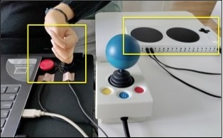

### (S10) Joy Stick
The Joy Stick helped in pointing the target area without any uninteded clicks. Here is the screenshots of the joy stick:

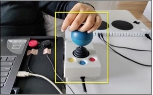

### (S11) JoyToKey program
Here is the button assignment that translate the mouse clicks to the external buttons via the XAC:

### (S15) Google chrome apps and extensions
Here is screenshot showing the ‘Scroll down’ using the keyboard shortcut ‘J/j’ by virtue of ‘Vimium’ that reduces the mouse function for viewing through the page:
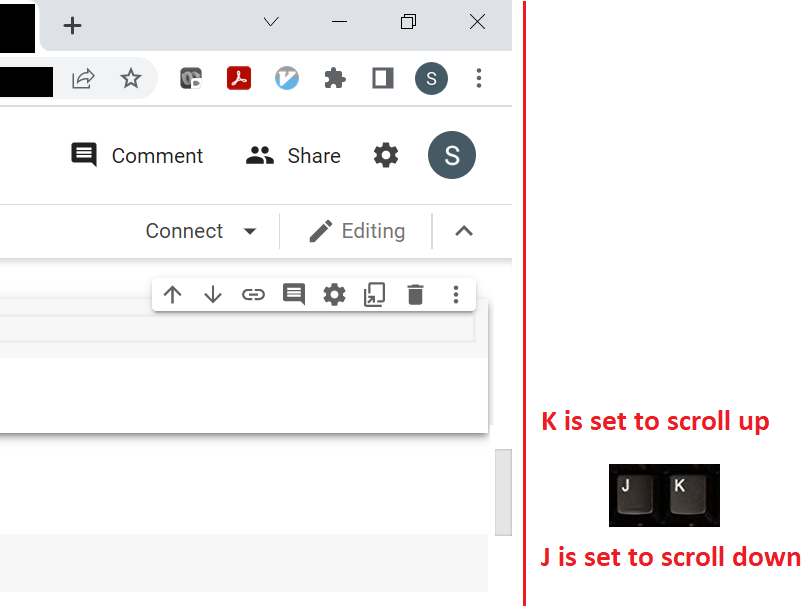

### (S20) Speech recognition input
We have used the mouse grid as a solution for the speech recognition input. You can find two screenshots for ProM and PM4Py showing how it enables clicking on specific element in each tool.

ProM

The overall picture before choosing any grid to zoom:

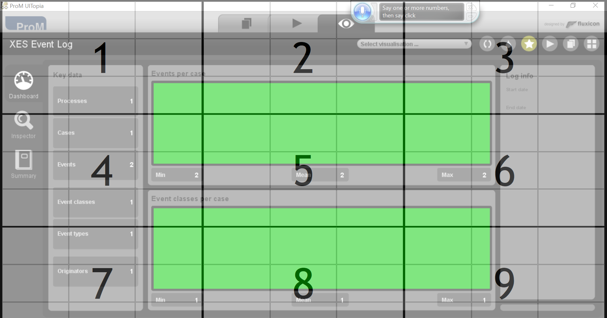

Clicking on the summary button:

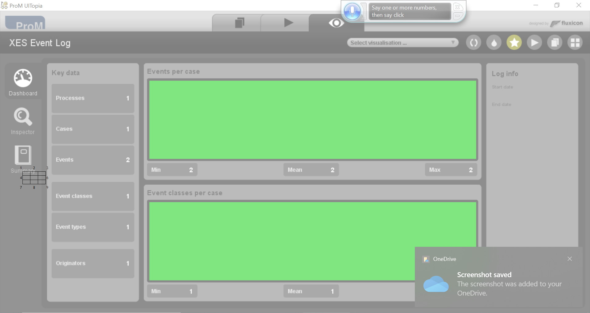

PM4Py

The overall picture before choosing any grid to zoom:

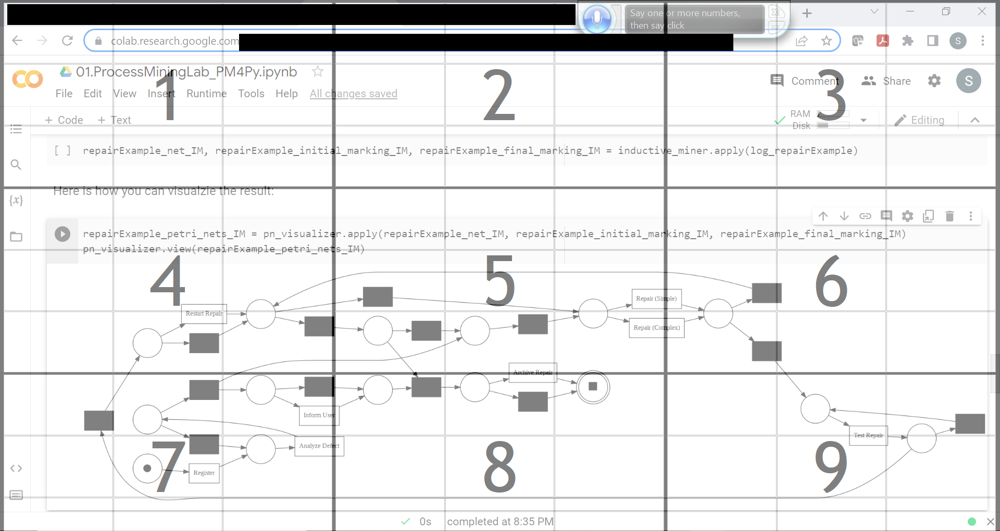

Clicking on the run button:

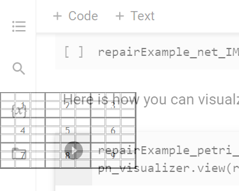

